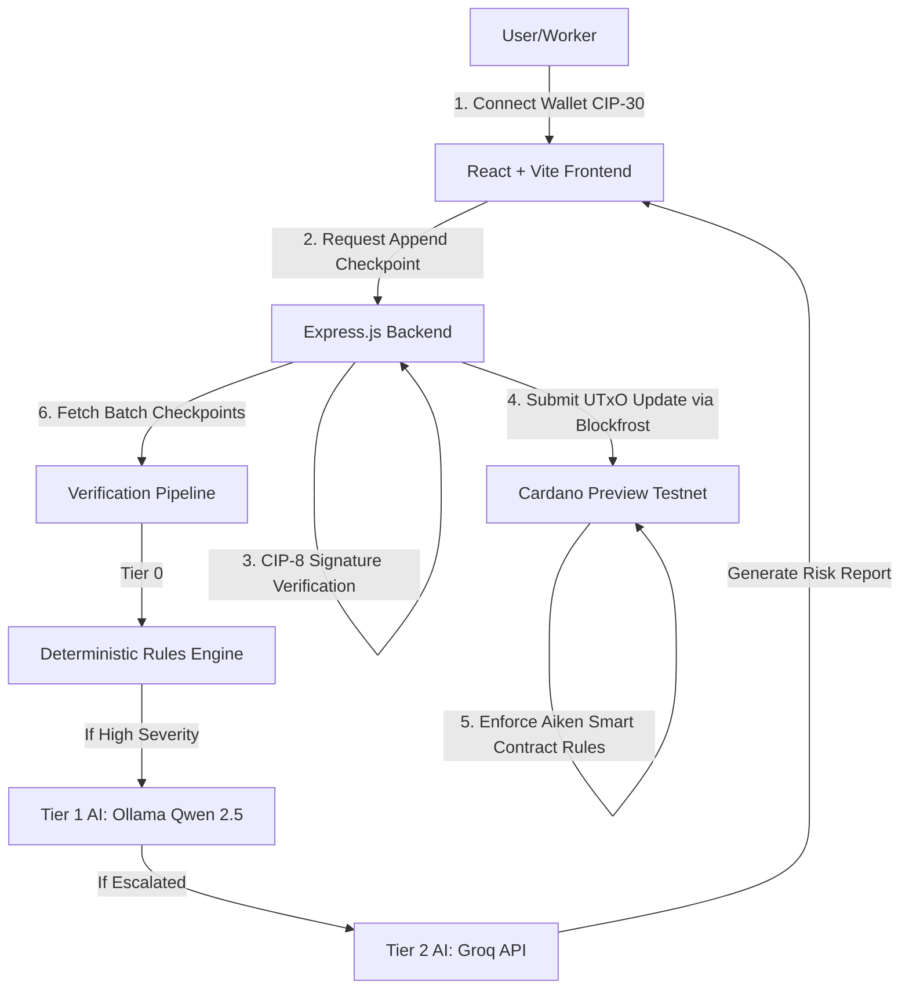

# TrueBatch 🏗️🔍

An unforgeable, append-only supply chain ledger for construction materials built on the **Cardano blockchain** with **Multi-Tier AI Fraud Detection**.

---

## 👥 Team Info & Participants

* **B Rahul** ([bolishettyrahul](https://github.com/bolishettyrahul))
* **Veera**

---

## 💡 Problem Statement

Construction material fraud—such as cement/steel adulteration, premature curing, and faked test certificates—regularly causes catastrophic building failures. Traditional paper certificates are easily forged, backdated, or reused, and there is no independent, immutable audit trail.

**TrueBatch** solves this by providing:
1. An **unforgeable, append-only digital history** on the Cardano blockchain for every material batch.
2. Cryptographic sign-offs required at each supply-chain checkpoint.
3. A **Multi-Tier AI Detection Layer** to identify inconsistencies, anomalies, and potential fraud patterns.

---

## 🚀 Solution Architecture & Pipeline

TrueBatch is designed with a **four-layer architecture** that guarantees record immutability and flags potential supply chain anomalies for human verification.



### 1. Data Layer (Cardano & Blockfrost)
* **Preview Testnet:** Utilizes the Cardano Preview testnet for low-cost, decentralized ledger tracking.
* **CIP-68 Token Pairs:** Every batch is represented by a CIP-68 token pair:
  * *Reference NFT:* Holds the mutable `BatchDatum` (immutable checkpoint history) and is locked in the validator.
  * *User NFT:* Represents ownership of the batch and can be transferred.

### 2. Smart Contract Layer (Aiken)
The smart contract validator (`validators/batch.ak`) enforces:
* **Append-Only Logic:** New checkpoints must be appended to the existing list (`new_checkpoints = old_checkpoints + [new_checkpoint]`). Existing checkpoints cannot be modified or deleted.
* **Role Verification:** The transaction signer's Public Key Hash (`signer_pkh`) must match the whitelisted role for the current stage.
* **Sequence Logic:** Checkpoints must progress strictly in order: `Manufactured` ➔ `LabTested` ➔ `Dispatched` ➔ `Delivered`.

### 3. Verification & AI Detection Layer (Three-Tier Pipeline)
Every time a batch is queried, it passes through our multi-tier detection pipeline:
* **Tier 0 (Deterministic Rules):** A rule engine checking for 7 specific violations:
  1. *Stage Jump:* Skip essential stages (e.g. going straight from Manufactured to Delivered).
  2. *Curing Time Violation:* Lab testing done less than 7 days after manufacturing.
  3. *Impossible Transit Time:* Transport between stages happens faster than physically possible.
  4. *Test Value Anomalies:* Material test metrics fall below structural standards (e.g. compressive strength < 45 MPa).
  5. *Batch ID Reuse:* Attempting to use the same ID in two active deliveries.
  6. *Actor Mismatch:* Unauthorized roles signing off on a stage (e.g. field engineer signing lab tests).
  7. *Timestamp Reversal:* A checkpoint timestamp is set before the previous checkpoint.
* **Tier 1 (Ollama Qwen 2.5:7b):** A local LLM analyzing Tier 0 flags and checkpoint history to differentiate between simple data entry mistakes and intentional fraud, deciding if escalation is necessary.
* **Tier 2 (Groq API):** If Tier 1 escalates, Groq generates a concise, plain-language risk assessment report for site engineers outlining exact issues, things to check on-site, and who to contact.

### 4. Interface Layer (Vite + React + Mesh SDK)
* **Premium Dashboard:** Modern user interface with dark/light mode, smooth animations, and visual timelines.
* **CIP-30 Wallet Connect:** Allows users to connect wallets (e.g., Lace, Eternl) to sign checkpoints.
* **CIP-8 Data Signing:** Verification of identity via cryptographic signatures before transaction submission.

---

## 🛠️ Tech Stack

* **Smart Contracts:** [Aiken](https://aiken-lang.org/)
* **Cardano Integration:** [Mesh SDK](https://meshjs.dev/), Blockfrost API
* **Frontend:** React, Vite, Tailwind CSS, Lucide Icons
* **Backend:** Node.js, Express, TypeScript
* **AI Engine:** Ollama (local Qwen 2.5:7b model), Groq API (cloud LLM)

---

## 🗂️ Project Structure

```text
├── aiken/                    # Aiken Smart Contract code
│   └── validators/
│       └── batch.ak          # Append-only state validator
├── src/
│   ├── backend/              # Node.js + Express API server
│   │   ├── verifyCheckpoint.ts
│   │   └── tier*.ts          # AI classification and reporting
│   └── frontend/             # React + Vite frontend application
│       ├── src/
│       │   ├── wallet.ts     # CIP-30 wallet connection & CIP-8 signature utilities
│       │   └── components/   # UI elements (Timeline, Search, RiskReports)
├── TrueBatch Design System/   # Tailwind/design system specifications
└── docs/                     # Design specs and documentation
```

---

## ⚙️ How to Run & Setup

### Prerequisites
* Node.js v18+
* [Aiken CLI](https://aiken-lang.org/installation-guide) (for compiling smart contracts)
* Ollama running locally with `qwen2.5:7b` (optional for local Tier 1 AI runs)

### 1. Smart Contracts
Compile the Aiken validator:
```bash
cd aiken
aiken build
```

### 2. Environment Configuration
Create a `.env` file in the root directory based on the `.env.template`:
```ini
BLOCKFROST_API_KEY=your_preview_network_key
BLOCKFROST_URL=https://cardano-preview.blockfrost.io/api/v0
GROQ_API_KEY=your_groq_api_key
OLLAMA_BASE_URL=http://localhost:11434
```

### 3. Backend Server
Install dependencies and run the Express development server:
```bash
# From root directory
npm install
npm run dev:backend
```

### 4. Frontend Application
Install dependencies and run the Vite React app:
```bash
cd src/frontend
npm install
npm run dev
```
